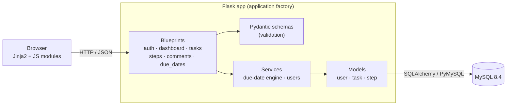

<div align="center">

# LedgerLine

### Month-End Financial Close — Process Tracker

A Kanban-style web app that turns a finance team's recurring month-end close into a transparent, deadline-aware workflow — with business-day scheduling, recurring tasks, role-based access, and threaded collaboration.

[](https://github.com/aidantracy/Tailored_Task_Tracker/actions/workflows/ci.yml)


</div>

---

## Overview

Accounting teams close the books on a fixed cadence every month, where dozens of interdependent tasks must land on specific **business days** — not calendar days. Spreadsheets and email threads make that fragile and opaque.

**LedgerLine** models the close as a board of milestone *steps* (e.g. *Populate Financials → First Review → Second Review → Flash JE Upload → Final JE Upload*), each anchored to the *Nth business day* of the month. Tasks flow across the board with live status, assignees, due dates, comments, and a full audit trail. Recurring work rolls forward automatically into each new month with its dates recalculated around weekends and holidays.

It was built by a three-person team as a semester-long software-engineering capstone/internship, with a full test pyramid and CI from day one.

## Highlights

- **Business-day scheduling engine** — computes the *Nth business day* of any month, skipping weekends and federal holidays via [`workalendar`](https://github.com/workalendar/workalendar). Due dates aren't stored statically; they're derived so the board stays correct as months change.
- **Recurring tasks that roll forward** — flag a task as recurring and it's cloned into future months with its due date re-anchored to the equivalent business day, keeping a linked series in sync.
- **Kanban board** — status-driven columns (*Not Started · In Progress · Stuck · Done*) grouped under business-day milestone steps, with month-to-month navigation.
- **Role-based access & onboarding** — admin role gated by decorator, invitation-key signup flow, and user promotion. Authentication uses hashed passwords, a Pydantic-validated password policy, and a self-service reset flow.
- **Collaboration** — per-task threaded comments with unread counts and read-receipts.
- **Safe by default** — soft-delete with restore, an append-only audit log with timestamps for every state change, and a `/health/db` readiness endpoint.
- **Deploy-anywhere** — application-factory pattern with `dev / test / prod / prodtest` configs and `APP_ROOT` support for hosting under a URL sub-path behind a reverse proxy.

## Tech Stack

| Layer | Technologies |
|---|---|
| **Backend** | Python 3.10+, Flask (application factory + blueprints), Flask-Login, Flask-Bcrypt, Flask-SQLAlchemy, Flask-Cors |
| **Validation** | Pydantic (typed request schemas, email + password-policy validators) |
| **Database** | MySQL 8.4, PyMySQL, SQL schema + seed migrations |
| **Frontend** | Jinja2 templates, modular vanilla JavaScript, Tailwind utility classes + custom CSS |
| **Scheduling** | workalendar (holiday / business-day calendar math) |
| **DevOps** | Docker / Podman Compose, Dockerfile, Gunicorn |
| **Testing & CI** | pytest + coverage, QUnit, Cypress (E2E), Ruff, mypy, GitHub Actions |

## Architecture



The codebase keeps a clean separation of concerns: thin route handlers (blueprints) delegate to a **services** layer for business logic (the due-date engine, user management), validate input through **Pydantic schemas**, and persist through **models**. Cross-cutting concerns live in `utils/` (uniform JSON responses, custom exceptions). The whole app is assembled by a single `create_app()` factory, which selects configuration by environment and makes the app trivially testable.

## Getting Started

> **Prerequisites:** [Docker](https://www.docker.com/) **or** [Podman](https://podman.io/) with Compose. Everything else (Python, MySQL) runs inside containers.

```bash
# 1. Clone
git clone https://github.com/aidantracy/Tailored_Task_Tracker.git
cd Tailored_Task_Tracker

# 2. Create your local env file from the template
cp .env.example .env        # Windows: copy .env.example .env

# 3. Build & start the app + database
podman compose up -d --build      # or: docker compose up -d --build
```

Then open **http://localhost:5000** and create an account on the sign-up screen. The database is auto-provisioned from `db/init/` (schema + seed data) on first run, so the board comes pre-populated with a realistic month-end close.

To tear everything down:

```bash
podman compose down -v            # or: docker compose down -v
```

## Testing

A full test pyramid runs locally and on every push/PR via GitHub Actions:

```bash
pip install ".[dev]"        # backend + tooling
pytest                      # backend unit tests (models, routes, schemas, services)

npm install
npm test                    # QUnit frontend unit tests
npm run cypress:run         # Cypress end-to-end tests (requires containers running)
```

Static analysis is enforced with **Ruff** (lint) and **mypy** (types).

## Project Structure

```
src/dashboard/
├── __init__.py          # application factory, extension wiring, config selection
├── config.py            # dev / test / prod / prodtest configs
├── routes/              # blueprints: auth, dashboard, tasks, steps, comments, due_dates
├── services/            # business logic: due-date engine, user service
├── schemas/             # Pydantic request/response validation
├── models/              # user, task, step
├── utils/               # uniform responses, custom exceptions
├── templates/           # Jinja2 pages (dashboard, admin, settings, base)
└── static/              # JS modules, CSS, assets
db/init/                 # MySQL schema + seed migrations
tests/                   # backend (pytest) · frontend (QUnit) · e2e (Cypress)
.github/workflows/       # CI pipeline
```

## Security Notes

- Passwords hashed with **bcrypt**; complexity enforced server-side (8+ chars, upper/digit/special).
- All input validated through typed **Pydantic** schemas before it reaches the data layer.
- Parameterized SQL throughout to prevent injection.
- Session protection via Flask-Login; secrets kept out of source control via `.env` (only `.env.example` is committed).

## Contributors

Built by **Bakir Grbic**, **Aidan Tracy**, and **Alexander Daniluc**.

## License

Released under the [MIT License](LICENSE).
